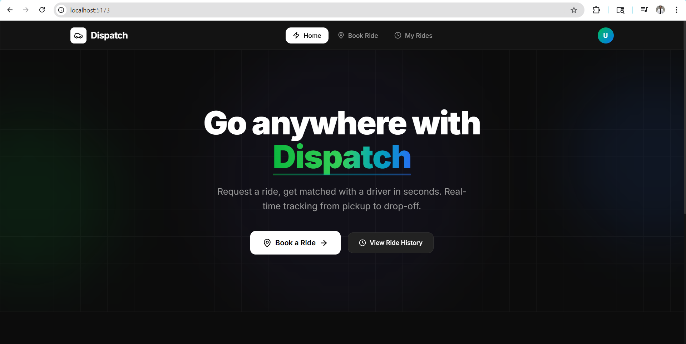
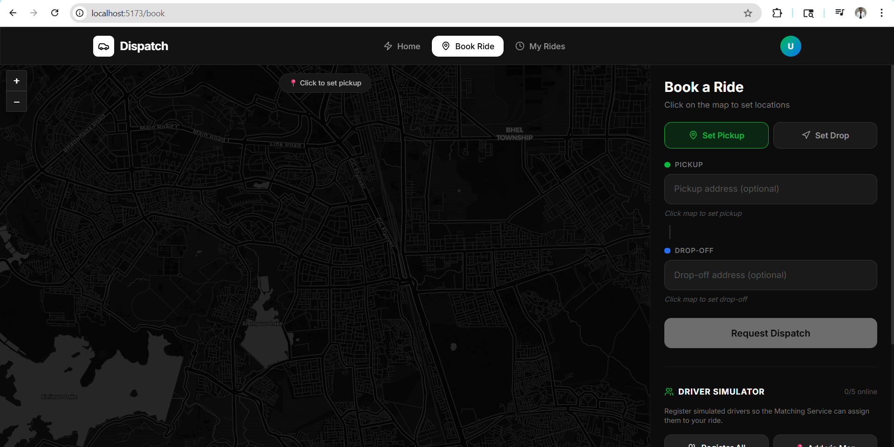
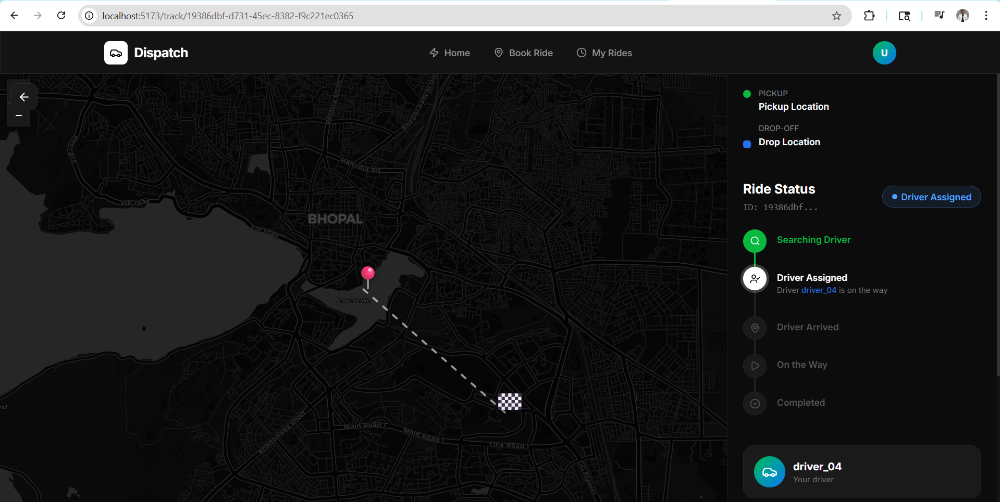
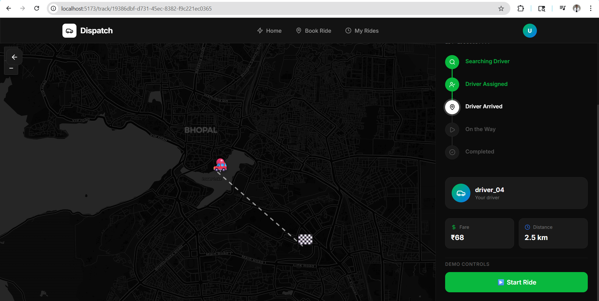
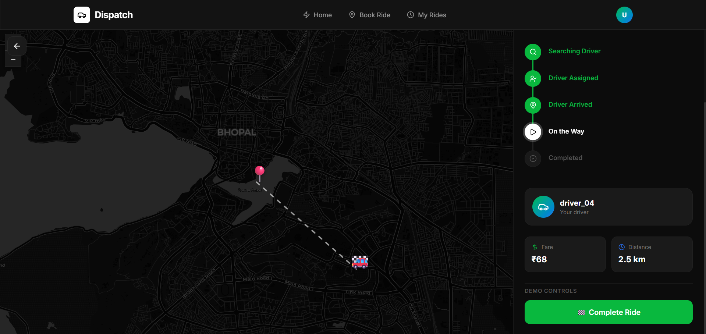
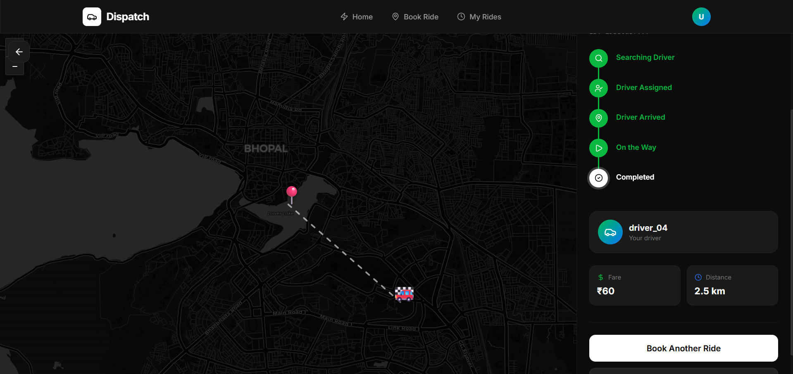

# Dispatch
## A Real-Time Driver Matching and Ride Booking System
> A production-style full-stack application that handles end-to-end ride booking — using Redis geospatial indexing to find nearby drivers in under 1ms, a weighted scoring algorithm to pick the best match, and Kafka event streaming to assign them asynchronously in real time.

<div align="center">


</div>

---

## What is Dispatch?

**Dispatch** is a full-stack ride-hailing platform that automates the complete driver dispatching pipeline:

- Drivers stream GPS locations in real time
- A user books a ride from the React frontend
- Redis geospatial indexing finds nearby drivers in under 1ms
- A scoring algorithm picks the **best** driver — not just the closest
- Kafka event streaming notifies and assigns the driver asynchronously
- The user tracks the ride through its full lifecycle on an interactive map

All of this happens **asynchronously**, in **under 10 seconds**, end-to-end.

---

## Application Preview
### Home Page


### Book Ride



### Track Ride




## Frontend Preview

The React frontend includes:

| Page | Description |
|---|---|
| **Home** | Landing page with project overview |
| **Book a Ride** | Form to enter pickup/drop, see estimated fare |
| **Track Ride** | Live ride status tracker with polling |
| **History** | All past rides for a user |

**Key Components:**
- `MapView.jsx` — Interactive map showing pickup, drop, and driver location
- `RideBookingForm.jsx` — Ride request form with fare preview
- `RideStatusTracker.jsx` — Live status updates (REQUESTED → DRIVER\_ASSIGNED → IN\_PROGRESS → COMPLETED)
- `DriverSimulator.jsx` — Dev tool to register fake drivers directly from the UI
- `StatusBadge.jsx` — Colour-coded ride status indicator
- `useRidePolling.js` — Custom hook that polls ride status every 3 seconds

---

## Architecture

```
┌──────────────────────────────────────────────────────────────────┐
│                         DISPATCH                                 │
│                                                                  │
│   ┌─────────────────────────────────┐                            │
│   │        React Frontend           │                            │ 
│   │  Book Ride · Track · History    │                            │
│   └──────────┬──────────────────────┘                            │
│              │ HTTP (REST API calls)                             │
│    ┌─────────▼──────────┐   ┌──────────────────────────────┐     │
│    │   Ride-Service      │   │      Location-Service        │    │
│    │   (port 8082)       │   │        (port 8081)           │    │
│    │                     │   │                              │    │
│    │  Fare Calculation   │   │  GEOADD / GEOSEARCH / GEOPOS │    │
│    │  Ride Lifecycle     │   └──────────────┬───────────────┘    │
│    │  Kafka Producer     │                  │                    │ 
│    └──────┬──────────────┘               Redis                   │ 
│           │  ride.requested           Geo Index                  │
│           ▼                              ▲                       │
│        Kafka  ──────────────────────────►│                       │
│           │                    ┌─────────┴──────────┐            │
│           │  driver.found      │  Matching-Service  │            │ 
│           ◄────────────────────│    (port 8083)     │            │
│           │                    │                    │            │
│           │                    │  Score & Rank      │            │
│    ┌──────▼──────────┐         │  Driver Selection  │            │
│    │     MySQL       │         └────────────────────┘            │
│    │  (rides table)  │                                           │
│    └─────────────────┘                                           │
└──────────────────────────────────────────────────────────────────┘
```

---

##  Services & Pages

### Backend Services

| Service | Port | Responsibility |
|---|---|---|
| **Location-Service** | `8081` | Stores and queries driver GPS via Redis geospatial index |
| **Ride-Service** | `8082` | Manages ride lifecycle, fare calculation, Kafka events |
| **Matching-Service** | `8083` | Finds, scores, and assigns the best nearby driver |

### Frontend Pages

| Page | Route | Description |
|---|---|---|
| **Home** | `/` | Landing page |
| **Book Ride** | `/book` | Book a new ride |
| **Track Ride** | `/track/:rideId` | Live ride status tracking |
| **History** | `/history` | User's past rides |

---

##  Tech Stack

### Frontend
| Technology | Purpose |
|---|---|
| React 18 | UI framework |
| Vite | Build tool and dev server |
| React Router | Client-side routing |
| Axios | HTTP client for API calls |
| Custom Hooks | `useRidePolling` for live status |

### Backend
| Technology | Purpose |
|---|---|
| Java 17 | Language |
| Spring Boot 3.2 | Framework |
| Redis 7.2 | Geospatial driver location index |
| Apache Kafka | Async event streaming between services |
| MySQL 8.0 | Persistent ride storage |
| Spring Data JPA | ORM for MySQL |
| Docker Compose | Local infrastructure |

---


## Getting Started

### Step 1 — Clone the Repository

```bash
git clone https://github.com/sarthak-jain03/Dispatch.git
cd Dispatch
```

### Step 2 — Start Infrastructure

Start Redis, Kafka, Zookeeper, and MySQL with one command:

```bash
docker compose up -d
```

Verify containers are running:

```bash
docker compose ps
```

All five should show `running`:
```
NAME         STATUS
zookeeper    running
kafka        running
redis        running
mysql        running
kafka-ui     running
```

---

### Step 3 — Start Backend Services

Open **three separate terminals:**

**Terminal 1 — Location Service**
```bash
cd location-service

# Mac / Linux
./mvnw spring-boot:run

# Windows
mvnw.cmd spring-boot:run
```

**Terminal 2 — Ride Service**
```bash
cd ride-service
./mvnw spring-boot:run      # or mvnw.cmd on Windows
```

**Terminal 3 — Matching Service**
```bash
cd matching-service
./mvnw spring-boot:run      # or mvnw.cmd on Windows
```

Expected output in each terminal:
```
✅ Location Service  started on port 8081
✅ Ride Service      started on port 8082
✅ Matching Service  started on port 8083
```

---

### Step 4 — Start the Frontend

Open a **fourth terminal:**

```bash
cd frontend
npm install
npm run dev
```

Visit **http://localhost:5173** in your browser.

---

##  Testing the Flow

1. Open **http://localhost:5173**
2. Go to **Book a Ride** → use the Driver Simulator to add drivers
3. Fill in pickup and drop location → Submit
4. You'll be redirected to **Track Ride** — watch the status update live
5. Visit **History** to see completed rides


---

## API Reference

### Location Service — `http://localhost:8081`

| Method | Endpoint | Description |
|---|---|---|
| `POST` | `/location/update` | Driver sends current GPS location |
| `GET` | `/location/nearby?lat=&lng=&radius=&limit=` | Find drivers within radius |
| `GET` | `/location/driver/{driverId}` | Get a specific driver's position |
| `DELETE` | `/location/driver/{driverId}` | Remove driver from available pool |

### Ride Service — `http://localhost:8082`

| Method | Endpoint | Description |
|---|---|---|
| `POST` | `/ride/request` | User books a ride |
| `GET` | `/ride/{rideId}` | Get ride details and status |
| `GET` | `/ride/user/{userId}` | Get all rides for a user |
| `PUT` | `/ride/{rideId}/arrived` | Driver arrived at pickup |
| `PUT` | `/ride/{rideId}/start` | Ride started |
| `PUT` | `/ride/{rideId}/complete` | Ride completed |
| `PUT` | `/ride/{rideId}/cancel` | Cancel the ride |
| `GET` | `/ride/health` | Health check |

### Matching Service — `http://localhost:8083`

| Method | Endpoint | Description |
|---|---|---|
| `GET` | `/matching/health` | Health check |
| `GET` | `/matching/config` | View algorithm configuration |

---

##  Kafka Topics

| Topic | Producer | Consumer | When |
|---|---|---|---|
| `ride.requested` | Ride-Service | Matching-Service | User books a ride |
| `driver.found` | Matching-Service | Ride-Service | Driver is assigned |

---

##  Ride Status Lifecycle

```
REQUESTED ──► DRIVER_ASSIGNED ──► DRIVER_ARRIVED ──► IN_PROGRESS ──► COMPLETED
    │
    └─────────────────────────────────────────────────────────────► CANCELLED
```

The React frontend's `useRidePolling` hook polls `GET /ride/{rideId}` every 3 seconds and updates the UI automatically as the status changes.

---


##  Author

**Sarthak Jain**\
Email: sarthakjain4452@gmail.com\
[GitHub](https://github.com/sarthak-jain03) \
[LinkedIn](https://www.linkedin.com/in/sarthak-jain-3a2b38276/)

---

